# FlashBot

SwiftUI iOS16 Flashcard App but in a chat form

FlashBot is an iOS16 App written in SwiftUI that allows you to learn new vocabulary (or more broadly any concept) via the "[Flashcard](https://en.wikipedia.org/wiki/Flashcard)" mechanism. But instead of showing a card, it works likes a chat.

It is a work in progress, but it already has basics functionalities.

## Screenshots

|-|-|
|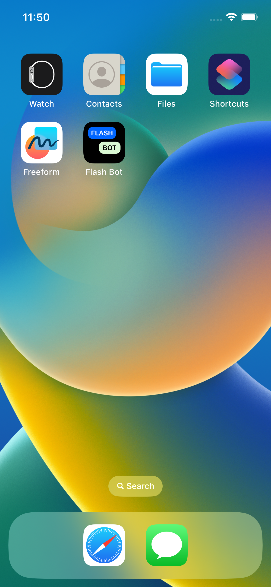|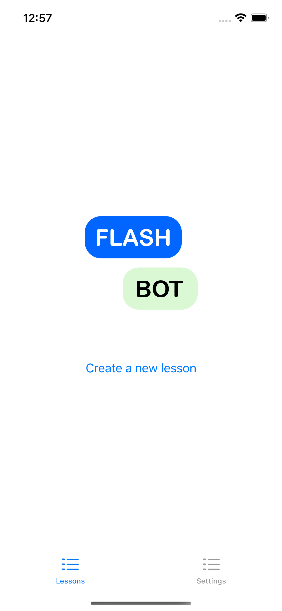|
|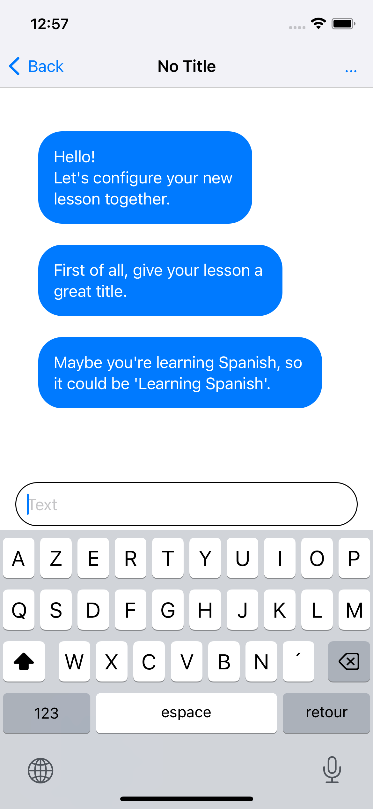|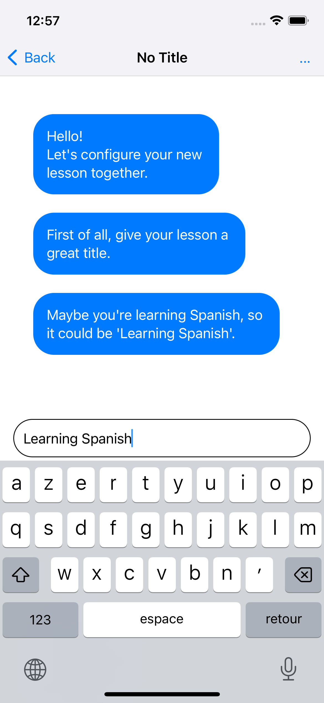|
|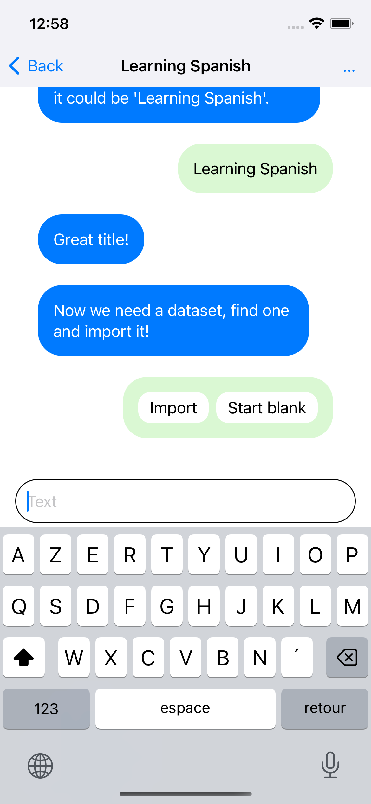|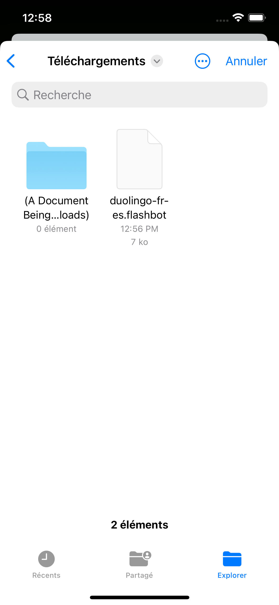|
|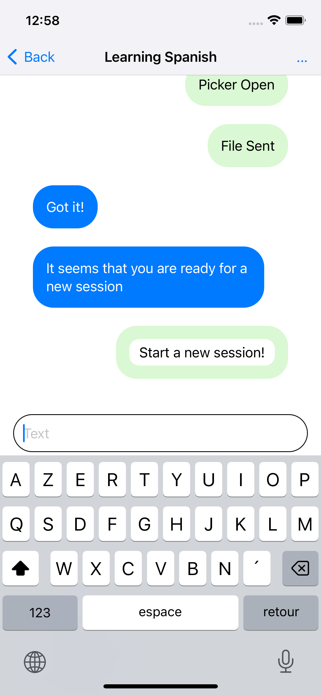|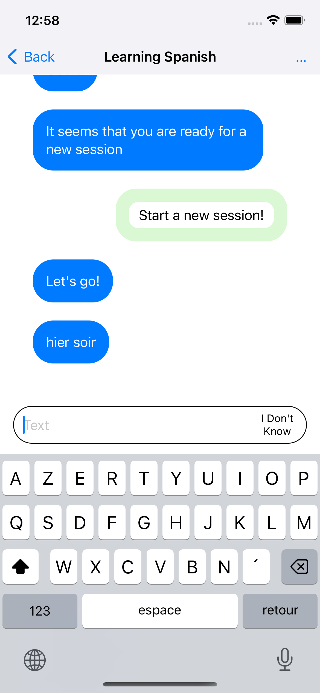|
|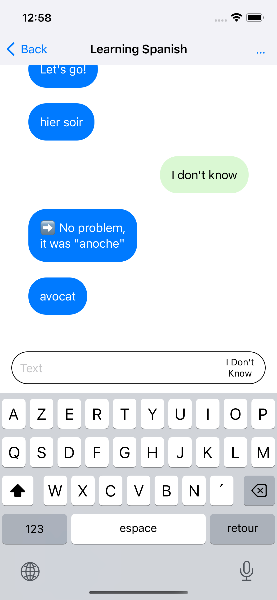|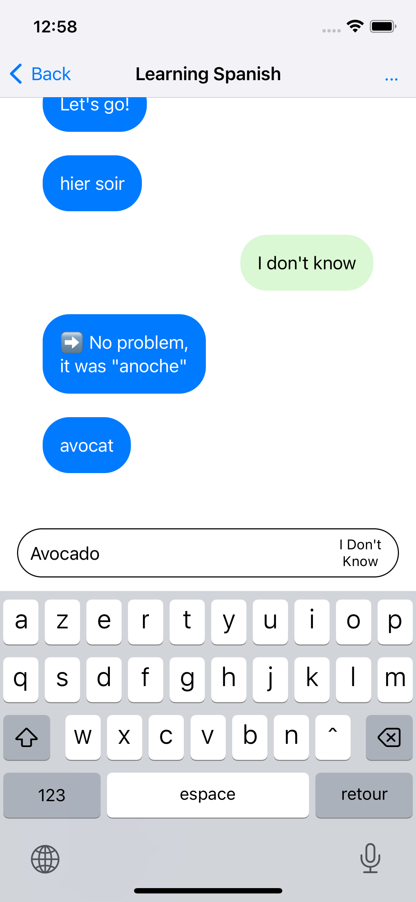|
|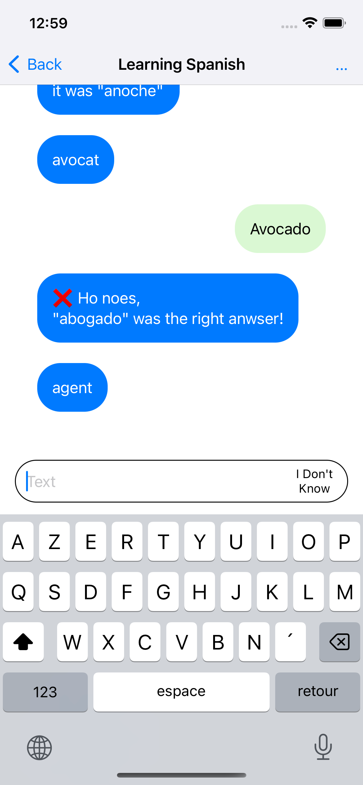|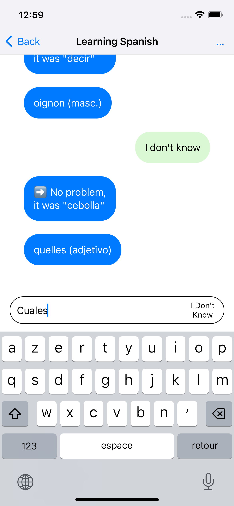|
|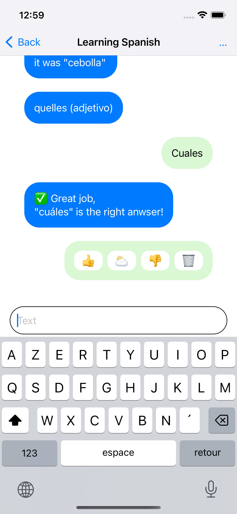|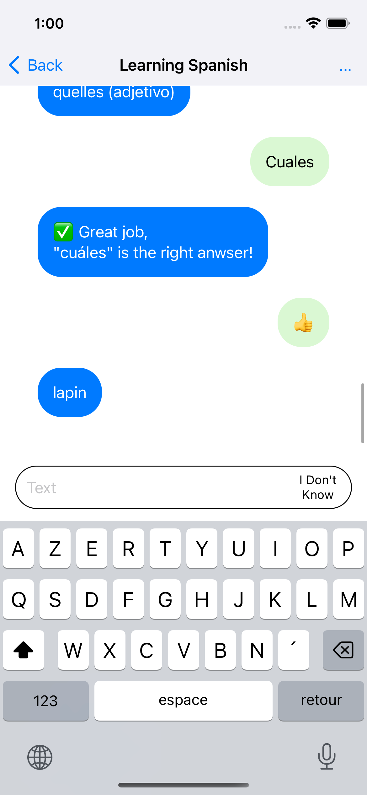|
|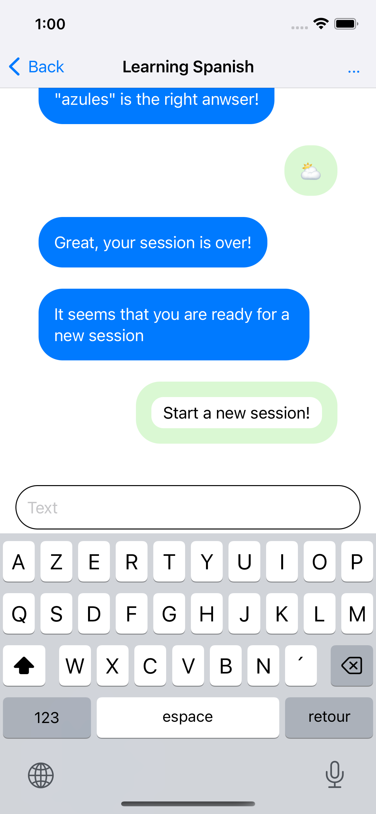|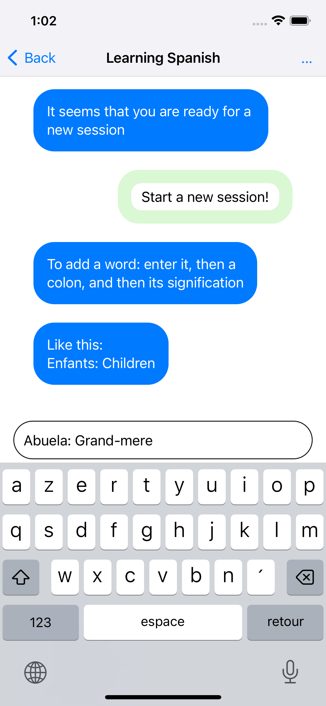|
|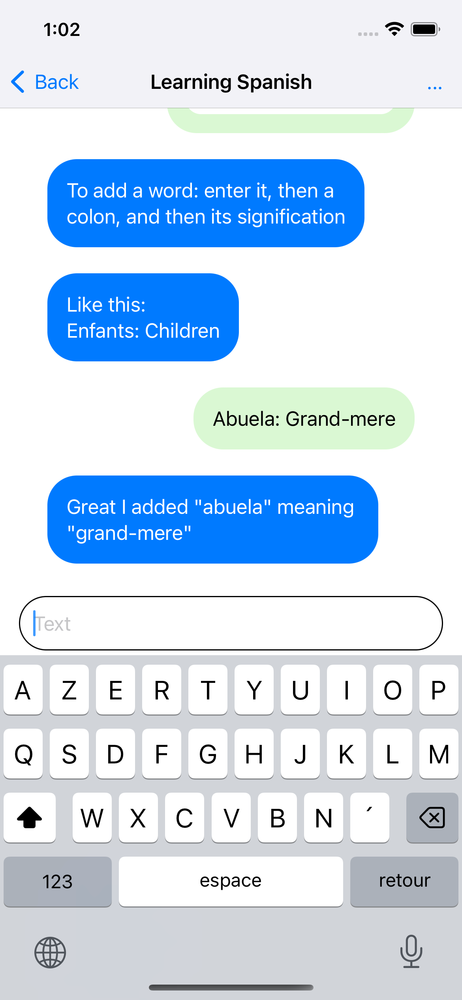| |

